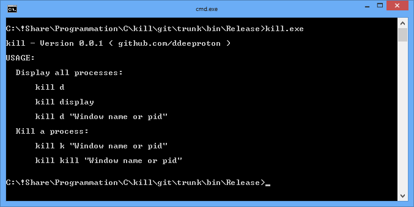

# USAGE:

  #### Display all processes:

      kill d

      kill display

      kill d "Window name or pid"

  #### Kill a process:

      kill k "Window name or pid"
	  
      kill kill "Window name or pid"

  #### Download 

https://github.com/ddeeproton/kill/raw/master/bin/Release/kill.exe

  #### Compilation

  "Code Blocks 16.01" ( www.codeblocks.org )
  
  http://sourceforge.net/projects/codeblocks/files/Binaries/16.01/Windows/codeblocks-16.01-setup.exe
  
  "GNU GCC Compiler" ( www.adacore.com )
  
  http://mirrors.cdn.adacore.com/art/591c97f0a3f5d779ee51082d